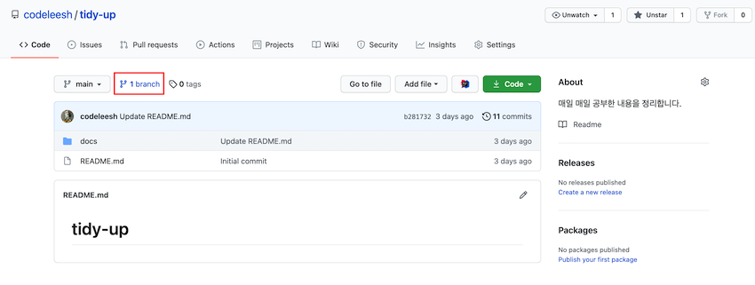
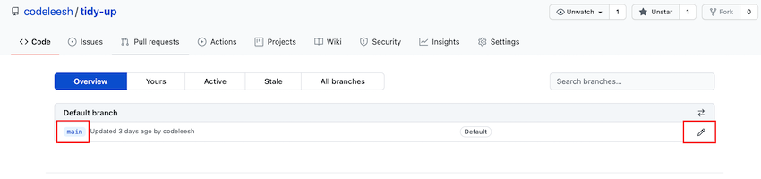
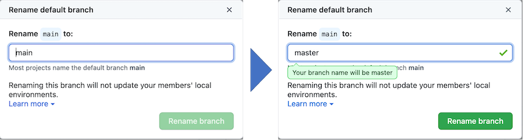
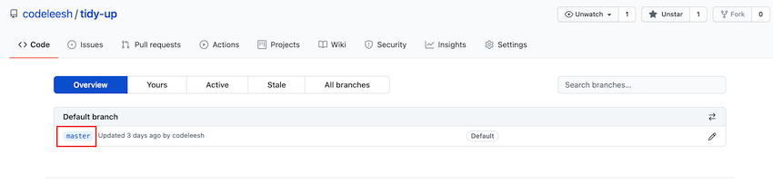

## 원인

- Git을 통해 소스를 내려받기 위해 설정 중, 아래와 같은 Error를 만나게 된다.

  ```bash
  (base) lsh@isanghoui-MacBookPro tidy-up % git init
  /Users/lsh/Desktop/00_StudyWork/03_GIT_WORK/tidy-up/.git/ 안의 빈 깃 저장소를 다시 초기화했습니다
  (base) lsh@isanghoui-MacBookPro tidy-up % git remote add origin https://github.com/codeleesh/tidy-up.git
  (base) lsh@isanghoui-MacBookPro tidy-up % git pull origin master
  fatal: couldn't find remote ref master
  ```

  

- pull 명령어의 branch 명과 github의 있는 branch 명과 다르기 때문에 발생한 내용

  

## 해결 방법

- GitHub 접속 -> 해당 Repository -> branch 선택



- 편집 버튼 선택



- branch 명 변경



- 변경된 내용 확인



- 명령어 재실행 결과

  ```bash
  (base) lsh@isanghoui-MacBookPro tidy-up % git pull origin master
  remote: Enumerating objects: 56, done.
  remote: Counting objects: 100% (56/56), done.
  remote: Compressing objects: 100% (44/44), done.
  remote: Total 56 (delta 10), reused 0 (delta 0), pack-reused 0
  오브젝트 묶음 푸는 중: 100% (56/56), 12.85 KiB | 313.00 KiB/s, 완료.
  https://github.com/codeleesh/tidy-up URL에서
   * branch            master     -> FETCH_HEAD
   * [새로운 브랜치]   master     -> origin/master
  ```