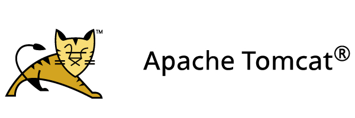
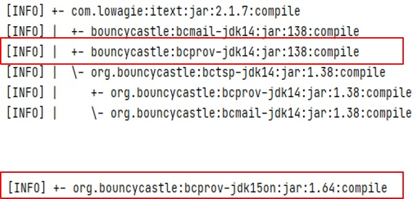
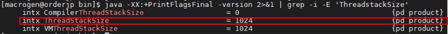
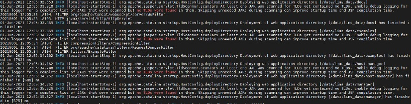

## Tomcat 소스 반영 시 순환참조 문제 발생

- Error 원인

  - bcprov 라이브러리의 순환참조 문제 발생으로 추정

- Error 내용

  ```bash
  The class hierarchy being processed was  [org.bouncycastle.asn1.ASN1EncodableVector->org.bouncycastle.asn1.DEREncodableVector->org.bouncycastle.asn1.ASN1EncodableVector
  ```


### 순환참조

- 참조하는 대상이 서로 물려 있어서 참조할 수 없게 되는 현상

- 확인 방법 

  ```bash
  mvn dependency:tree
  ```

  - Library 종속 관계 파악하기 위하여 Tree Format으로 결과를 보여준다

- 결과




### 해결 방법

- 라이브러리 제거
- JVM 옵션 조정
- Tomcat 옵션 처리


#### 라이브러리 제거

- 관련 라이브러리가 웹 어플리케이션에서 사용하지 않는다면 제거
- 사용 중인 프로젝트에서는 해당 라이브러리 사용 중임으로 불가


#### JVM 옵션 조정

- ThreadStackSize를 조정하여 처리

- ThreadStackSize의 Default 값은 Linux 64bit 기준 1M으로 동일하게 설정되어 있음

- ThreadStackSize를 너무 크게 잡아 Thread가 많이 늘어난다면 `OutOfMemory`가 발생할 수 있으며, 너무 작게 잡은 상태라면 `StackOverFlow` 발생

- Default값으로 설정되어 있고 적절한 값을 찾아서 적용하기에는 시간 부족으로 인하여 진행하지 않음..(건들기가 무서운것도 있었음..)

- JVM 옵션 확인 명령어

  ```bash
  java -XX:+PrintFlagsFinal -version 2>&1 | grep -i -E 'ThreadstackSize'
  ```




#### Tomcat 옵션 처리

- 실제 진행한 방법

  - 의존성 문제라면 maven build 시 문제 발생하겠지만 build는 정상적으로 수행됨
  - WAS 구동 시 발생된 문제로 판단하여 Tomcat에서 해당 라이브러리 Skip 처리함

- 수행 내용

  - Tomcat의 catalina.properties 열기

    ```bash
    vi /home/macrogen/tomcat/conf/catalina.properties
    ```

  - `jarsToSkip` 찾은 후 해당 라이브러리 추가


- Server Restart


### 추가 개선 : Log 줄이기

- WAS 구동 시 웹 어플리케이션에 포함된 라이브러리 파일을 탐색하는데 해당 라이브러리 파일에 커스텀 태그와 관련된 TLD 파일이 없을 때 발생
- 라이브러리 파일 탐색 순서
  - 특정 Annotation을 가진 클래스 검색
  - TLD 파일
- 로그 내용



- 진행 시 개선 효과
  - TLD 파일이 없는 라이브러리 파일을 탐색하는 건 시간 낭비이므로 TLD 파일 검색 대상에서 해당 라이브러리 파일을 제외하면 톰캣 시작 시간을 줄일 수 있고 불필요한 Log 내용을 쌓지 않음