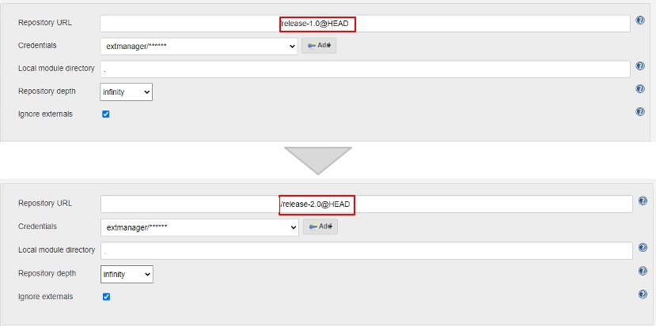
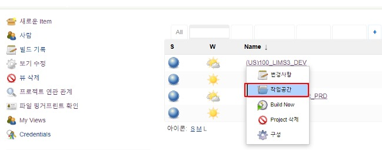
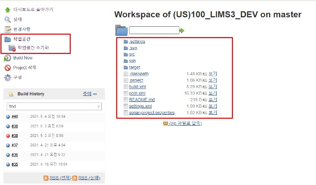
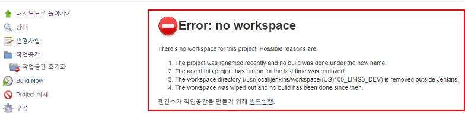
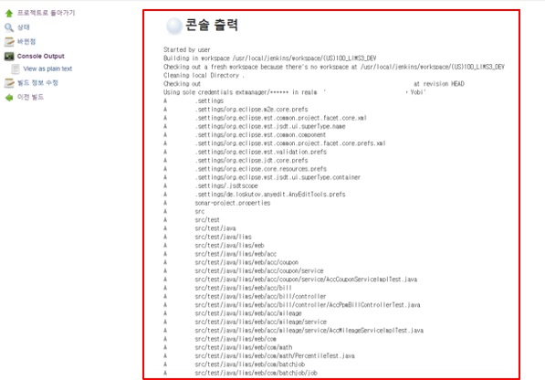
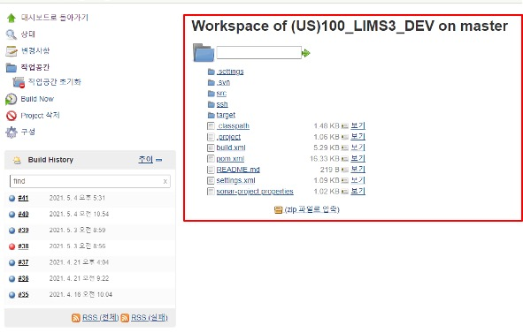

## Repository 변경으로 인한 Build Error 발생

- Repository 변경으로 인하여 기존 Jenkins 작업 공간이 변경되지 않아서 신규 소스를 Check-Out 받지 않아서 `Build Error.` 발생

- `Build Error` 내용

  ```
  Class not found
  ```


## Case

- Repository URL 변경으로 release-2.0 소스를 내려 받지 못하는 케이스

- 기존 release-1.0 -> release-2.0 으로 변경


## 해결 방법

#### 1. 작업공간 초기화 진행

- 기존 작업 공간을 초기화 시켜주고 변경된 Repository URL을 통해서 새롭게 Check-Out 받을 수 있도록 처리

- 초기화해줄 Item을 선택 -> 작업공간 선택




#### 2. 작업공간 초기화 성공 

- 초기화 성공 시 오른쪽 소스가 삭제됨

- SVN에서 Check-Out받은 Jenkins 서버의 폴더 안에 저장된 소스

- Jenkins 서버의 폴더 안에 저장된 소스 경로의 변경된 Repository 갱신되지 않아서 Build 되지 않은 문제 발생



#### 3. 작업 공간 초기화 완료

- `Error:no workspace` 출력




#### 4. `Build Now` 진행

- Build Now 실행하면 저장된 Reposiotry에서 새롭게 소스를 Check-out 받음



#### 5. `Build Now` 성공

- Build Now 성공 시 프로젝트 소스가 생성됨


